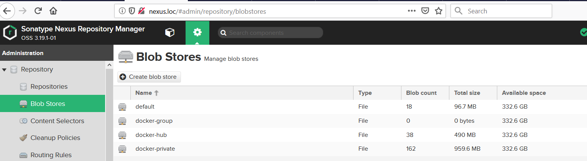
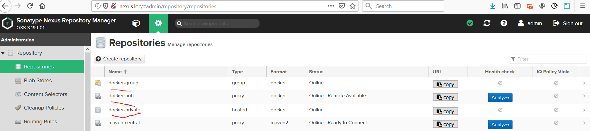
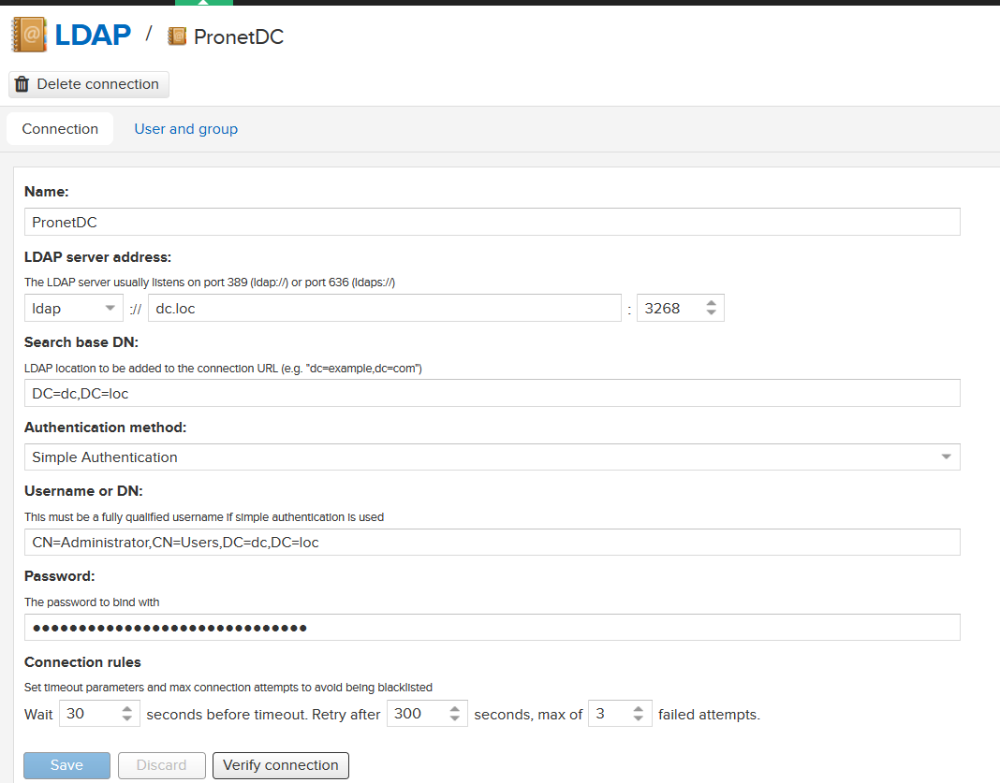
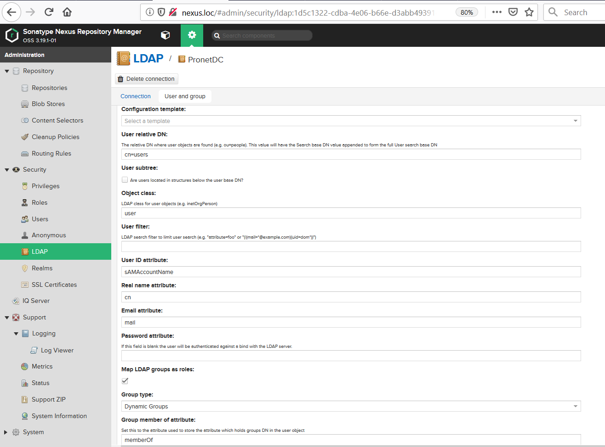
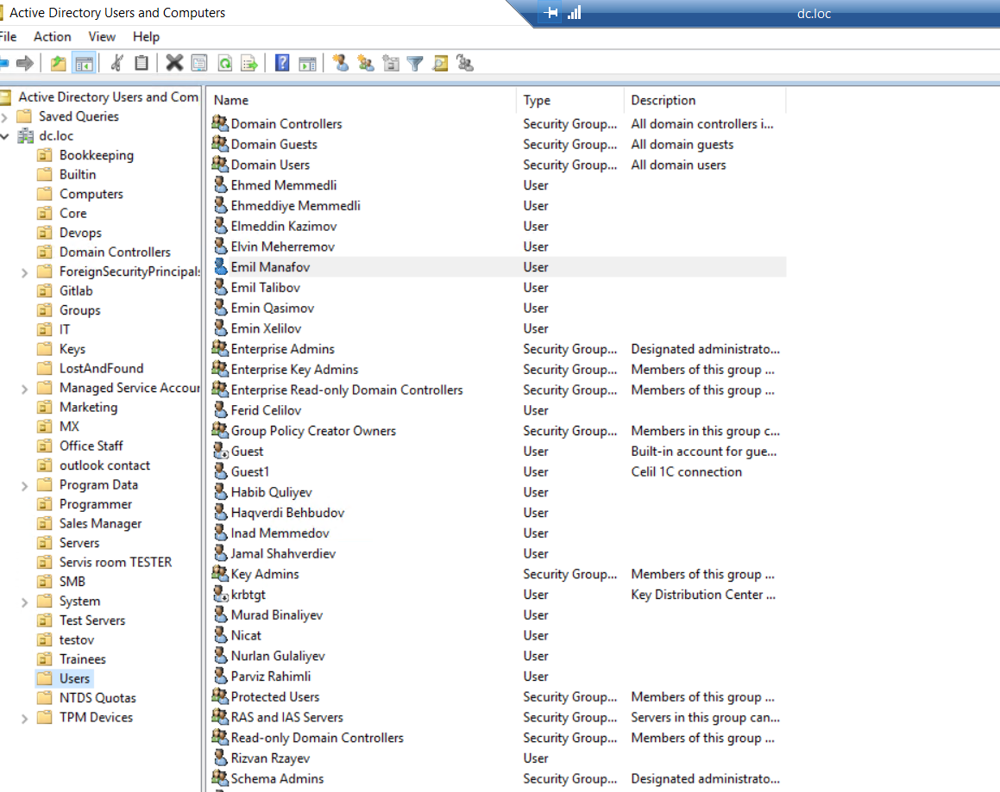
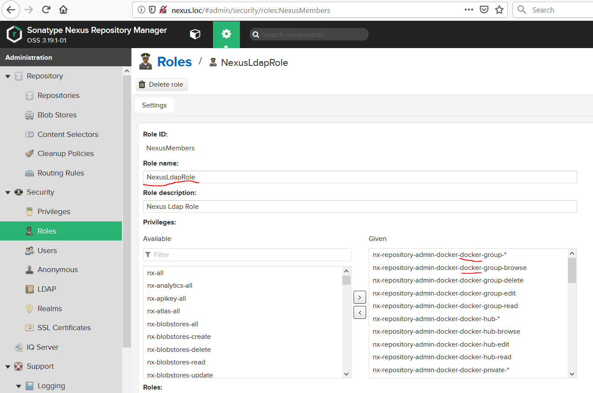
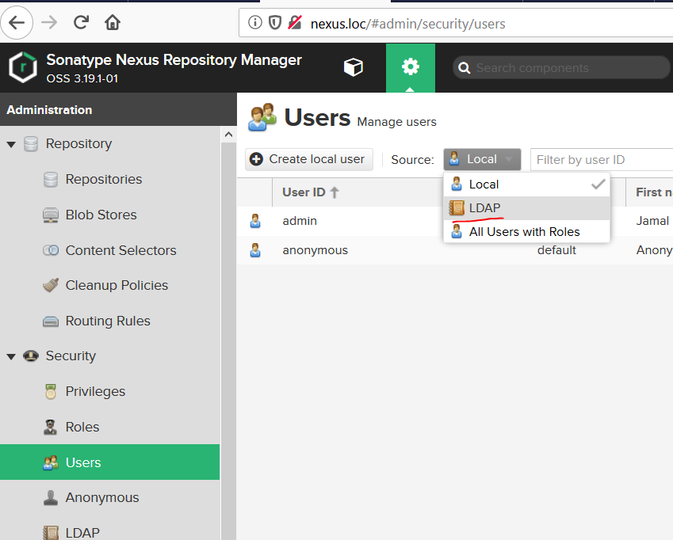
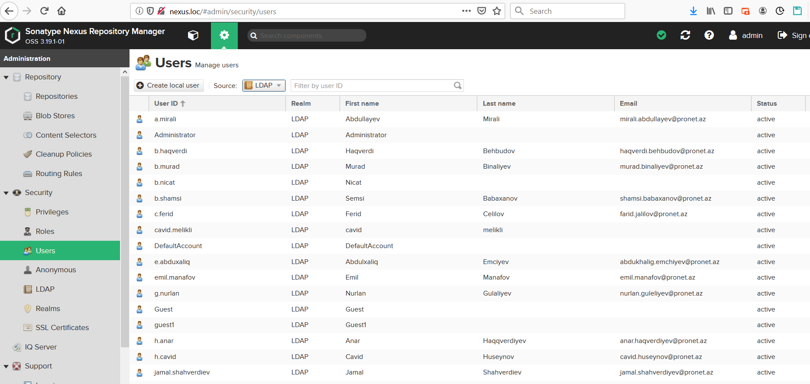
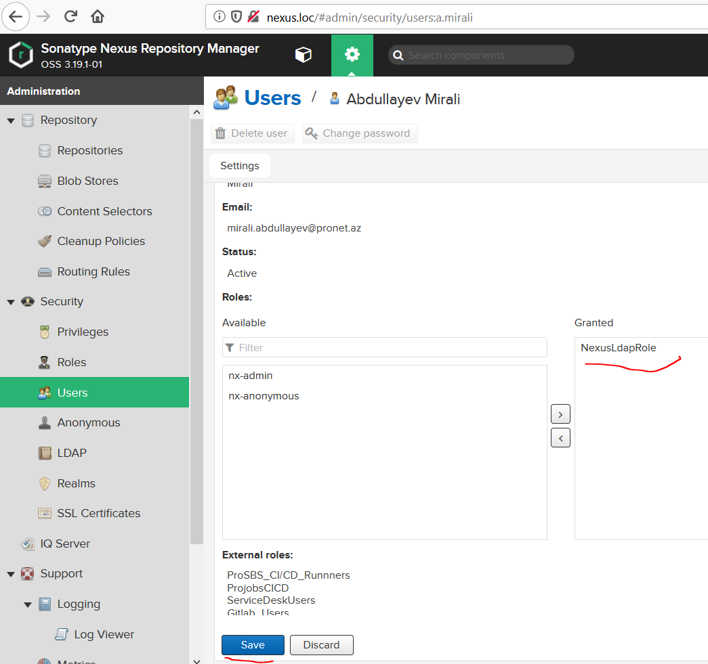

#### Create Docker Blob repositories:


#### Create Docker repositories:


#### Integrate Nexus OSS with Active Directory:



#### Move domain users under Users folder:


#### Create new role and give access to all docker permissions:


#### Look at the Domain Users in the Nexus:



#### Give permission to the user to use Docker regostry server:



#### Add the following lines to the `/etc/docker/daemon.json` file:
```bash
$ cat <<EOF > /etc/docker/daemon.json
{
      "insecure-registries" : ["nexus.loc:8082","nexus.loc:8083"]
}
EOF
$ systemctl restart docker
```

#### Login to the Nexus registry server for PUSH and Pull images with Domain Contoller credentials:
```bash
$ docker login -u dc.username -p 'password' nexus.loc:8082
$ docker login -u dc.username -p 'password' nexus.loc:8083
```

#### Pull some image to test:
```bash
$ docker pull nexus.loc:8082/phpdockerio/php7-fpm
```

#### Build some image with Tag to push our local repo:
```bash
$ docker build -t nexus.loc:8083/inadjavaapp:1 .
```

#### Write new tag to the existing image and then push it to the remote Docker Registry server:
```bash
$ docker tag docker-smb_emailsenderworker nexus.loc:8083/smb_emailsenderworker:v1 
$ docker push nexus.loc:8083/smb_emailsenderworker:v1
```

#### Push new image to the local docker registry server:
```bash
$ docker push nexus.loc:8083/inadjavaapp:latest
```
